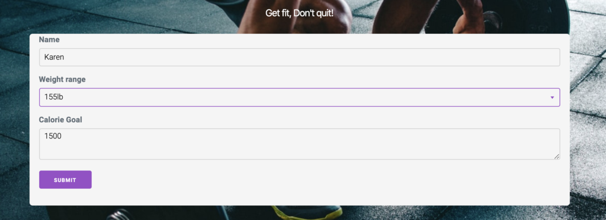
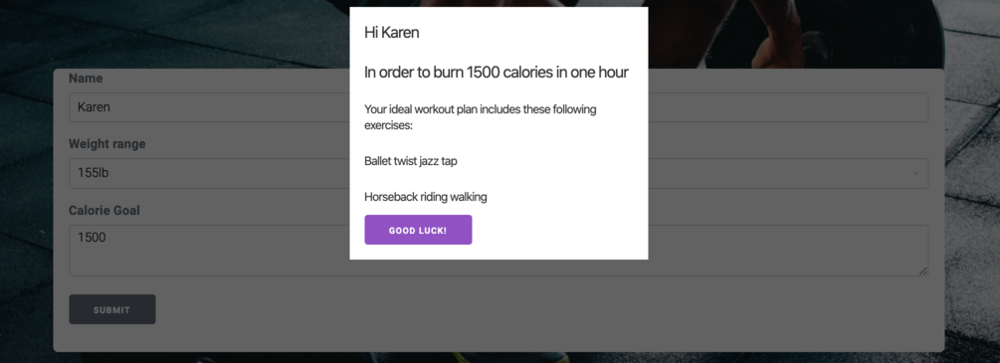

# [Witness-the-Fitness](https://witness-the-fitness.herokuapp.com/)

## Description 
**Witness-the-Fitness** is an app designed to give the user two exercises chosen at random when they enter how many calories they want to burn. All exercises are designed to last 1 full hour. No two days will ever be the same!

## Installation
opWhen you open the file in VS Code, you will need to run **'npm i'** to install the packages provided.
In your Mysql workbench, create the database **'fitness_db'**. Now inside your integrated terminal, make sure to run **'npm run seeds'** to give your database all the exercise data.

## Usage 

After launching the app, you can insert your name in the box provided. In the drop down menu, choose the closest weight to your current weight. In the calorie goal box, input the amount of calories you want to burn in the span of one hour. If you would like to look at a list of all the exercises provided along with the amount of calories burned per lb, you can access it by the 'All Exercises' link at the top of the page.

## Technologies Used 
1. Milligram
    - A minimalistic CSS framework
2. UI KIT
   - A lightweight and modular front-end CSS framework
    for developing fast and powerful web interfaces.
3. Jquery
    - Easy access to the DOM for manipluation of screen content
4. Handlebars Templating
    - Easy templating engine
5. Trello
    - Project management tool
6. Sequelze
    - JS style acccess to MySQL database
7. Express
    - for HTML routing and API queries

## Credits
###### [DeBelen, Toni Rose](https://github.com/tonirose311)
###### [Evia, Flory Ann](https://github.com/fevia)
###### [Fullerton, Sam](https://github.com/samdfullerton)
###### [Kavuu, Steve](https://github.com/sck916)

## Future Development
- Create an exercise history page where users can see their past activity and track their own progress.
- Create a forum so that users can talk to each other about the exercises they have done.
- Give user more options for...
    - weight
    - amount of exercises they want to do
    - the length of time they want to exercise for

